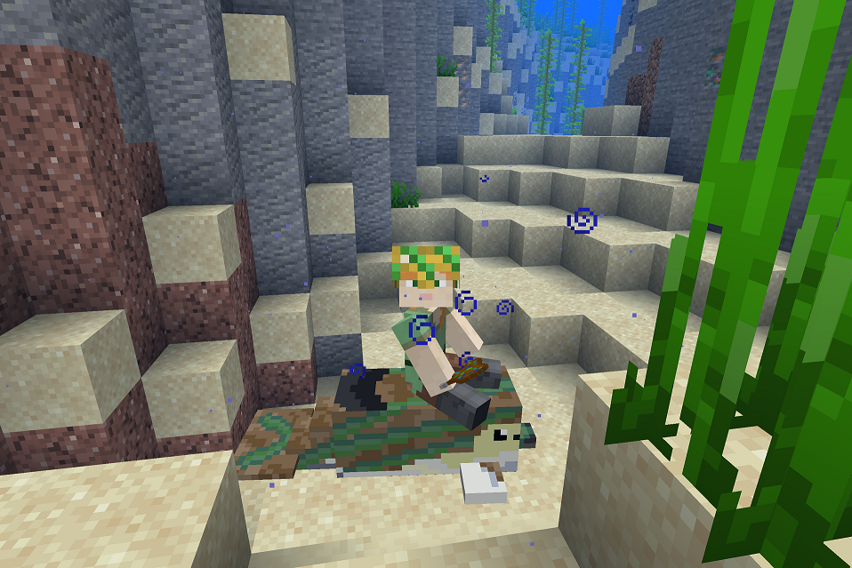

### **Befriend and ride** a variety of dolphin species in Minecraft, gaining gifts to level up! **Fundraising** for WDC.
#### ⬆️Now for Minecraft 1.19.2!

[Minecraft: Java Edition 1.19.2](https://www.minecraft.net/en-us/store/minecraft-java-bedrock-edition-pc) / [Minecraft Forge for 1.19.2](https://files.minecraftforge.net/net/minecraftforge/forge/index_1.19.2.html) / [Fabric Loader 0.14.9](https://fabricmc.net/use/installer/) / [Fabric API 0.60.0+1.19.2](https://www.curseforge.com/minecraft/mc-mods/fabric-api/files/3936024)

# Fundraising to save dolphins from entanglement in nets, hunting and captivity.
## 👇👇👇
[JustGiving.com/dolphinsofthedeep](https://justgiving.com/dolphinsofthedeep)
## 👆👆👆

#### Features
* Meet 3 naturally-spawning species of dolphin: Common Dolphin, Bottlenose & Pink River Dolphin
* Befriend dolphins by giving them fish, and then ride them with a saddle, crafting and equipping armour.
* Receive gifts and a custom material, delphinium, to give you a marine theme!

#### Fundraising
If you **enjoy this free mod**, please show your support by giving a **voluntary donation** to the [Whale and Dolphin Conservation charity on this JustGiving page](https://justgiving.com/dolphinsofthedeep):

[justgiving.com/dolphinsofthedeep](https://justgiving.com/dolphinsofthedeep)

* The effects of **accidental capture in nets** have already taken their toll on New Zealand's [Endangered Hector's](https://www.iucnredlist.org/species/4162/44199757) and [Critically Endangered Maui's](https://www.iucnredlist.org/species/39427/44200192) Dolphins, and [this trend will spread](https://www.iucnredlist.org/species/134817215/195828797#threats) if we don't act soon.
* [**Over 1,500 whales** and similar numbers of dolphins](https://uk.whales.org/our-4-goals/) are victims of **purposeful hunting**.
* [**Over 3,600**](https://uk.whales.org/our-4-goals/) whales and dolphins are still held in captivity.

Through **raising awareness**, taking **political action** and **providing alternatives**, WDC aims to take action to prevent all these factors putting cetaceans in danger. To learn more about the actions WDC is taking, **[please see their website](https://uk.whales.org/our-4-goals/)**.

#### Credits
>  Thank you to PeetaKeeta, MG, AG and CG for helping with playtesting, graphics, and ideas!

#### FAQs
##### How do I install this mod?

* Close the Minecraft Launcher.
* Download [Minecraft Forge for 1.19](https://files.minecraftforge.net/net/minecraftforge/forge/index_1.19.2.html) (Recommended Version) and double-click on the downloaded file.
  * Click "Install for client"
* Download and install [Fabric Loader](https://fabricmc.net/use/installer/) the same way.
  * Select "Minecraft Version: 1.19" and "Loader Version: 0.14.9".
* Open the Minecraft Launcher, and under *Installations* click the folder icon next to `fabric-loader-1.19.2`.
  * Your file viewer should open.
  * Open the `mods` folder.
  * Empty this folder, and then download and move these JAR files into it:
    * [Fabric API 0.60.0+1.19.2](https://www.curseforge.com/minecraft/mc-mods/fabric-api/files/3936024)
    * Dolphins of the Deep 1.0.1 (The .JAR file in the [Releases section](https://github.com/WebCoder49/dolphinsofthedeep/releases))
  * Go back to the *Play* tab, change the version to `fabric-loader-1.19.2`, and click *Play*!

If the game crashes or you notice a bug, please report it under the `Issues` tab.

##### Can I use this mod in a modpack? Is it open source?

Yes. Dolphins of the Deep is licensed under [the GNU Lesser General Public License Version 3.0](https://en.wikipedia.org/wiki/GNU_Lesser_General_Public_License) or any later version; it's free, libre and open source software.

<small>Logo above by José Obed</small>

**Non-legally binding:** This means any modified versions you make of the mod must be licensed the same and have their source code available to those who download the mod. This requirement is limited in scope, so you can use the mod with a closed source game (Minecraft), or include it in a modpack with other mods under any license, including closed source ones.

**Legally binding:** Please see [the LICENSE file](LICENSE).
